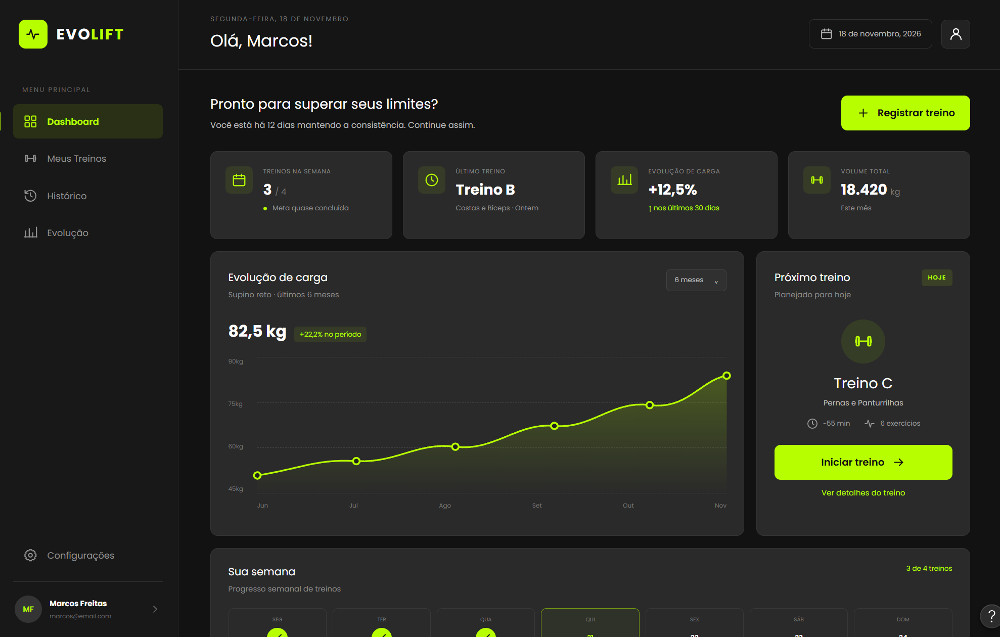

# Evolift

[]()
[]()
[]()

**Instituição:** CEUB  
**Curso:** Ciência da Computação  
**Disciplina:** Desenvolvimento Web  
**Turma / Semestre:** 2026.2  
**Professor:** Felippe Pires Ferreira  
**Status do projeto:** Fase 1 — documentação e modelagem em revisão

---

## Sumário

1. [Descrição do projeto](#1-descrição-do-projeto)
2. [Funcionalidades](#2-funcionalidades)
3. [Demonstração](#3-demonstração)
4. [Tecnologias utilizadas](#4-tecnologias-utilizadas)
5. [Arquitetura](#5-arquitetura)
6. [Organização dos diretórios](#6-organização-dos-diretórios)
7. [Participantes](#7-participantes)
8. [Como executar](#8-como-executar)
9. [Configuração](#9-configuração)
10. [Testes](#10-testes)
11. [Uso de inteligência artificial](#11-uso-de-inteligência-artificial)
12. [Contribuição e fluxo de trabalho](#12-contribuição-e-fluxo-de-trabalho)
13. [Histórico de versões](#13-histórico-de-versões)
14. [Limitações e próximos passos](#14-limitações-e-próximos-passos)
15. [Licença, referências e contato](#15-licença-referências-e-contato)

---

## 1. Descrição do projeto

O **Evolift** é uma proposta de aplicação web para ajudar pessoas que praticam musculação a organizar seus treinos e acompanhar a própria evolução.

A ideia surgiu da dificuldade de manter registros de exercícios, séries, repetições e cargas em anotações espalhadas. Com o tempo, fica mais difícil saber o que foi feito em cada treino e comparar os resultados.

O sistema foi pensado para reunir essas informações em um só lugar. O usuário poderá montar treinos, registrar o que realmente executou e consultar seu histórico. Também haverá um perfil de administrador, responsável pelas contas cadastradas e pelo catálogo geral de exercícios, sem acesso automático aos históricos pessoais.

### Objetivos

**Objetivo geral:** planejar uma aplicação web para organizar treinos de musculação e acompanhar a evolução do usuário.

**Objetivos específicos:**

- permitir o cadastro de exercícios personalizados e a consulta a exercícios disponíveis no catálogo;
- organizar treinos e os exercícios que fazem parte de cada um;
- registrar séries, repetições e cargas de sessões realizadas;
- gerar um resumo ao concluir uma sessão de treino;
- permitir consultar histórico, evolução e relatórios;
- definir uma API REST própria e a integração com o catálogo público da wger.

### Público-alvo

Pessoas que praticam musculação e desejam manter seus treinos organizados, além do administrador responsável pela manutenção das contas e do catálogo geral.

---

## 2. Funcionalidades

As funcionalidades abaixo são **planejadas**. Na Fase 1, elas estão sendo documentadas e modeladas, e não implementadas.

| Funcionalidade | Descrição | Status |
|---|---|---|
| Cadastro e login | Criar conta e acessar as funções permitidas ao perfil | Planejada |
| Exercícios próprios | Cadastrar e gerenciar exercícios personalizados | Planejada |
| Catálogo geral | Consultar exercícios compartilhados; manutenção pelo administrador | Planejada |
| Integração com wger | Consultar dados públicos de exercícios por meio de uma API externa | Planejada |
| Gerenciamento de treinos | Criar, consultar, editar e organizar treinos | Planejada |
| Sessões de treino | Iniciar e concluir sessões, registrando horários | Planejada |
| Registro de desempenho | Informar séries, repetições e cargas executadas | Planejada |
| Resumo de sessão | Gerar um resumo automaticamente ao concluir o treino | Planejada |
| Histórico | Consultar sessões anteriores do próprio usuário | Planejada |
| Evolução | Acompanhar resultados por exercício e período | Planejada |
| Relatórios | Visualizar indicadores dos treinos realizados | Planejada |
| Administração | Gerenciar contas e o catálogo geral com permissões específicas | Planejada |
| API REST | Definir acesso estruturado às funções do sistema | Planejada |

### Requisitos não funcionais

- **Usabilidade:** interface simples e responsiva para computador e celular.
- **Segurança:** autenticação, separação de permissões e proteção dos dados pessoais.
- **Integridade:** preservação de registros de sessões concluídas, mesmo após alterações nos treinos.
- **Disponibilidade:** uma falha na API externa não deve impedir a consulta aos exercícios locais.
- **Manutenção:** documentação e diagramas devem permanecer coerentes com as decisões do grupo.

---

## 3. Demonstração

Nesta etapa ainda não há uma aplicação executável. A demonstração disponível é feita por meio dos **protótipos de interface** produzidos para a Fase 1.



| Tela | O que representa |
|---|---|
| [Login](docs/prototipos/Login.png) | Acesso à conta |
| [Cadastro](docs/prototipos/Cadastro.png) | Criação de conta |
| [Dashboard](docs/prototipos/Dashboard.png) | Visão geral dos treinos |
| [Meus Treinos](docs/prototipos/Meus-Treinos.png) | Organização dos treinos |
| [Detalhes do Treino](docs/prototipos/Detalhes-Treino.png) | Exercícios que compõem um treino |
| [Registrar Treino](docs/prototipos/Registrar-Treino.png) | Registro de desempenho durante a sessão |
| [Histórico](docs/prototipos/Histórico.png) | Consulta aos treinos realizados |
| [Evolução](docs/prototipos/Evolução.png) | Indicadores de progresso |

A identidade visual e os protótipos estão documentados em [`docs/prototipos/identidade-visual.md`](docs/prototipos/identidade-visual.md). Eles representam o planejamento visual e ainda não são telas funcionais.

---

## 4. Tecnologias utilizadas

As tecnologias a seguir foram escolhidas ou previstas no planejamento. Não significa que todas já tenham sido instaladas ou utilizadas em código.

| Camada / atividade | Tecnologia | Situação na Fase 1 |
|---|---|---|
| Linguagem de programação | Python | Prevista |
| Backend | Django | Previsto |
| Interface | HTML, CSS e JavaScript | Previstos |
| Banco de dados | Relacional, produto ainda a definir | Modelo elaborado |
| API própria | REST com respostas JSON | Contrato inicial documentado |
| API externa | wger REST API | Integração planejada |
| Versionamento | Git e GitHub | Utilizados no repositório |
| Diagramas | Mermaid e draw.io | Utilizados na documentação |
| Protótipos | Figma Make | Utilizado na preparação visual |

As versões específicas das ferramentas de desenvolvimento serão definidas antes da implementação.

---

## 5. Arquitetura

A arquitetura planejada é organizada em interface web, aplicação Django, módulos com as regras do sistema e banco de dados relacional. A API REST faz parte dos serviços previstos para a aplicação. Uma integração separada permitirá consultar o catálogo público da wger.

```text
Usuário / Administrador
          |
       Navegador
          |
    Interface web
          |
     Backend Django ---- API REST do Evolift
          |
   Módulos do domínio
       /       \
Banco relacional  Adaptador wger -> API wger
```

O encerramento de uma sessão deverá registrar o horário de término e gerar automaticamente seu resumo usando os dados do próprio sistema. Somente administradores poderão alterar o catálogo geral e a situação de acesso das contas.

**Documentos de apoio:**

- [Arquitetura planejada e diagrama](docs/arquitetura/arquitetura.md)
- [Modelo de dados e diagrama ER](docs/banco-de-dados/modelo-de-dados.md)
- [Contrato inicial da API REST](docs/api/contrato-api-rest.md)
- [Plano de integração com a wger](docs/api/plano-api-externa.md)

### Endpoints principais previstos

| Método | Rota | Finalidade |
|---|---|---|
| `POST` | `/api/v1/users` | Criar conta |
| `GET` | `/api/v1/exercises` | Consultar exercícios |
| `POST` | `/api/v1/workouts` | Criar treino |
| `POST` | `/api/v1/workout-sessions` | Iniciar sessão |
| `POST` | `/api/v1/workout-sessions/{id}/finish` | Concluir sessão e gerar resumo |
| `GET` | `/api/v1/workout-sessions/{id}/summary` | Consultar resumo da sessão |
| `GET` | `/api/v1/progress` | Consultar evolução |
| `GET` | `/api/v1/reports/summary` | Consultar relatório do período |

O conjunto de rotas e seus exemplos está no contrato da API. Nenhuma dessas rotas está implementada nesta fase.

---


## 6. Organização dos diretórios

A documentação do Evolift está organizada na pasta `docs/`, seguindo a estrutura de modelagem proposta pelo professor.

```text
evolift/
├── README.md
├── docs/
│   ├── visao/
│   │   └── documento-visao.md
│   ├── planejamento/
│   │   └── planejamento.md
│   ├── modelagem/
│   │   ├── casos-de-uso/
│   │   │   ├── especificacoes-casos-de-uso.pdf
│   │   │   └── diagrama-casos-de-uso.png
│   │   ├── classes/
│   │   │   └── diagrama-de-classes.pdf
│   │   └── banco-de-dados/
│   │       ├── diagrama-er.pdf
│   │       └── modelo-logico.pdf
│   ├── arquitetura/
│   │   ├── arquitetura.md
│   │   ├── diagrama-arquitetura.png
│   │   └── diagrama-arquitetura.svg
│   ├── banco-de-dados/
│   │   ├── modelo-de-dados.md
│   │   ├── diagrama-er.png
│   │   └── diagrama-er.svg
│   ├── api/
│   │   ├── contrato-api-rest.md
│   │   └── plano-api-externa.md
│   └── prototipos/
│       ├── identidade-visual.md
│       └── [oito protótipos em PNG]
└── images/
    └── semaforo.png
```

A pasta `docs/modelagem/` reúne os documentos de modelagem solicitados no template do professor, incluindo casos de uso, diagrama de classes, modelo conceitual e modelo lógico.

Os PDFs representam os diagramas do Evolift. As imagens em PNG e SVG são utilizadas para facilitar a visualização dos modelos na documentação.


## 7. Participantes

| Integrante | Responsabilidade principal na Fase 1 |
|---|---|
| Davi Castro | Organização do repositório, README, Documento de Visão e Planejamento |
| Lucas Porcedda | Casos de uso, especificações textuais, protótipos e identidade visual |
| Eduardo Moreira | Arquitetura, modelo de dados, contrato REST e integração com API externa |

Todos participam da revisão final. As contribuições são registradas no histórico de commits do GitHub.

**Professor responsável:** Felippe Pires Ferreira.

---

## 8. Como executar

**A aplicação ainda não é executável.** Esta entrega corresponde somente à Fase 1, dedicada à documentação, aos protótipos e à modelagem.

Para consultar os arquivos localmente, é possível clonar o repositório:

```bash
git clone https://github.com/dcastroz/evolift.git
cd evolift
```

Não há, por enquanto, comandos de instalação de dependências ou inicialização do Django. Eles serão documentados quando houver implementação.

---

## 9. Configuração

As variáveis de ambiente, a configuração de banco de dados e os segredos da aplicação ainda não foram definidos porque o sistema não foi implementado na Fase 1.

Quando essa etapa começar, as instruções deverão ser registradas sem publicar senhas ou chaves privadas no repositório.

---

## 10. Testes

Ainda não existem testes automatizados de funcionalidades: o sistema não foi implementado.

A verificação nesta fase é documental, abrangendo a consistência entre Documento de Visão, casos de uso, diagramas, modelo de dados, contrato REST e protótipos. Os testes do sistema serão definidos antes da etapa de implementação.

---

## 11. Uso de inteligência artificial

O grupo considera a política de uso de IA informada na disciplina, representada pelo semáforo pedagógico abaixo:


### Declaração de uso

- **Houve uso de IA?** Sim.
- **Ferramentas utilizadas:** ChatGPT e Figma Make.
- **Finalidades:** apoio na organização e revisão textual da documentação, esclarecimento de dúvidas técnicas, elaboração e ajustes de modelos e diagramas, além da preparação dos protótipos visuais.
- **Responsabilidade dos integrantes:** conferir, adaptar e validar o conteúdo entregue, decidir o escopo do projeto e manter os arquivos coerentes com as orientações da disciplina.

O uso foi direcionado à preparação da Fase 1. A documentação não representa uma aplicação desenvolvida ou testada.

---

## 12. Contribuição e fluxo de trabalho

O projeto foi organizado em GitHub, com divisão de responsabilidades entre os integrantes e revisão conjunta dos documentos.

### Branches

- `main`: versão principal do repositório.
- `revisao-documentacao-fase-1`: revisão das entregas documentais antes de integrá-las à versão principal.

### Commits e revisão

O grupo utiliza mensagens de commit que descrevem as alterações, por exemplo `docs: atualiza casos de uso` e `docs: revisa modelo de dados`.

O fluxo previsto é revisar os arquivos localmente, registrar as mudanças em commits, enviar à branch de trabalho e conferir o resultado antes da integração à `main`.

---

## 13. Histórico de versões

| Versão / etapa | Período | Descrição |
|---|---|---|
| Estrutura inicial | 2026.2 | Repositório e organização inicial da documentação |
| Fase 1 — revisão | Outubro de 2026 | Revisão dos casos de uso, arquitetura, modelo de dados, APIs e protótipos |

A identificação final da entrega poderá ser registrada por commit ou tag após a revisão do grupo.

---


## 14. Limitações e próximos passos

### Limitações atuais

- A aplicação ainda não foi implementada, executada ou testada funcionalmente.
- As rotas da API REST são propostas documentadas, e não serviços disponíveis.
- Os protótipos representam as telas planejadas, sem integração real com o backend ou banco de dados.
- O banco de dados relacional específico ainda será definido.
- A integração com a API externa wger está planejada, mas ainda não foi implementada.

### Próximos passos para concluir a Fase 1

- [x] Elaborar o Documento de Visão.
- [x] Elaborar os casos de uso e suas especificações.
- [x] Definir a arquitetura planejada.
- [x] Elaborar o modelo conceitual e o modelo lógico de dados.
- [x] Elaborar o diagrama de classes UML.
- [x] Documentar a API REST e a integração com a wger.
- [x] Produzir os protótipos das telas principais.
- [x] Substituir os PDFs de exemplo do professor pelos documentos do Evolift.
- [ ] Conferir os links e a consistência final da documentação.
- [ ] Realizar a revisão final com os integrantes do grupo.
- [ ] Integrar a documentação revisada à branch principal.

A implementação com Django, a configuração do banco de dados e os testes funcionais pertencem às próximas etapas do projeto.

### Próximos passos para concluir a Fase 1

- [ ] Conferir os PDFs de modelagem herdados do template e substituir exemplos que não sejam do Evolift.
- [ ] Garantir que os diagramas tenham versões editáveis e versões de visualização.
- [ ] Revisar as referências e a consistência dos documentos.
- [ ] Integrar a documentação revisada à branch principal depois da conferência do grupo.

A implementação com Django e os testes funcionais pertencem a uma etapa posterior e não fazem parte desta entrega.

---

## 15. Licença, referências e contato

**Finalidade:** projeto acadêmico desenvolvido para a disciplina de Desenvolvimento Web do CEUB. Ainda não foi definida uma licença de distribuição de software.

### Documentação complementar

- [Documento de Visão](docs/visao/documento-visao.md)
- [Planejamento](docs/planejamento/planejamento.md)
- [Casos de uso e especificações em PDF](docs/modelagem/casos-de-uso/especificacoes-casos-de-uso.pdf)
- [Arquitetura](docs/arquitetura/arquitetura.md)
- [Modelo de dados](docs/banco-de-dados/modelo-de-dados.md)
- [Contrato REST](docs/api/contrato-api-rest.md)
- [Plano de integração com API externa](docs/api/plano-api-externa.md)
- [Protótipos e identidade visual](docs/prototipos/identidade-visual.md)

### Referências

- [Template de projeto da disciplina — Felippe Pires](https://github.com/Felippe-Pires/template_projects)
- [Documentação do Django](https://docs.djangoproject.com/)
- [Documentação da API wger](https://wger.readthedocs.io/en/latest/api/api.html)

### Contato

Dúvidas sobre a documentação podem ser registradas por meio das questões (*issues*) do próprio repositório ou encaminhadas aos integrantes do grupo.
