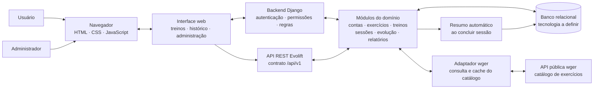

# Arquitetura planejada — Evolift

> Documento de planejamento da Fase 1. Descreve a organização prevista; não implementa Django, banco de dados nem API.

## Visão geral

O Evolift será uma aplicação web responsiva. O navegador apresenta a interface em HTML, CSS e JavaScript; o backend Django concentra autenticação, regras de negócio e acesso aos dados; um banco relacional armazena as informações próprias do usuário. Uma integração isolada consulta o catálogo público de exercícios do wger.

O diagrama editável está em [`diagrama-arquitetura.mmd`](./diagrama-arquitetura.mmd) e a visualização PNG em [`diagrama-arquitetura.png`](./diagrama-arquitetura.png).

## Responsabilidades das partes

| Parte | Responsabilidade prevista |
|---|---|
| Navegador | Apresentar as telas responsivas e enviar as ações do usuário. |
| Interface web | Renderizar telas e formulários de cadastro, treinos, registros, histórico, evolução e relatórios. |
| Aplicação Django | Aplicar autenticação, validar entradas, restringir dados ao usuário autenticado e coordenar as operações do sistema. |
| Módulos do domínio | Organizar as regras de contas, exercícios, treinos, registros de séries, histórico, consultas de evolução e relatórios. |
| API REST Evolift | Expor operações previstas no contrato inicial em `/api/v1/`. A biblioteca Django usada para implementá-la ainda não foi escolhida. |
| Persistência relacional | Guardar usuários, exercícios selecionados, treinos e registros de desempenho. O produto de banco de dados permanece em aberto. |
| Adaptador wger | Isolar chamadas externas, converter os dados do catálogo para o formato do Evolift, percorrer paginação e manter uma cópia recuperável do último catálogo obtido. |

## Fluxo previsto: consultar exercícios externos

1. O usuário pesquisa exercícios pela interface ou pela API do Evolift.
2. O backend consulta o catálogo local de exercícios e, quando necessário, o adaptador wger.
3. O adaptador percorre as páginas retornadas pelo wger e normaliza os campos usados pelo Evolift.
4. Os exercícios externos são apresentados com a origem e os créditos/licenças disponíveis. Quando um exercício externo for associado a um treino, seus dados de origem devem continuar identificáveis.
5. Se o wger estiver indisponível, o sistema apresenta a última cópia obtida e os exercícios locais. Não deve bloquear a consulta nem apagar registros próprios.

O endpoint público atual não oferece, na documentação consultada, uma busca textual de exercícios por nome. A estratégia planejada é paginar o catálogo e pesquisar sobre os dados normalizados em cache local, em vez de presumir que um parâmetro `name` será aplicado pelo serviço externo.

## Fluxo previsto: concluir uma sessão de treino

1. O usuário inicia uma sessão a partir de um treino cadastrado.
2. Durante a sessão, registra séries, repetições e cargas.
3. Ao selecionar "Finalizar treino", o backend valida os dados
   e registra o horário de término.
4. O sistema gera automaticamente o resumo da sessão, com
   duração, exercícios e resultados registrados.
5. Após a conclusão, os dados ficam disponíveis no histórico
   e podem ser utilizados nos relatórios e na evolução.

Se houver uma falha na geração do resumo, o sistema preserva
os registros e não confirma a conclusão até que o processo
possa ser finalizado corretamente.

Esse fluxo corresponde ao relacionamento de inclusão entre
UC07 — Concluir sessão de treino e UC08 — Gerar resumo da sessão.

## Segurança e limites do escopo

- O usuário autenticado só pode consultar ou alterar seus próprios treinos e registros.
- Senhas ficam sob responsabilidade do mecanismo de autenticação do Django; nunca são armazenadas em texto puro.
- Segredos de configuração não devem ser versionados.
- A comunicação externa é somente para leitura do catálogo público; o Evolift não envia dados pessoais ou de treino ao wger.
- Indisponibilidade externa, respostas inválidas e limites de tempo devem ser tratados explicitamente, com retorno ao cache quando houver dados anteriores.
- As camadas e os fluxos acima são propostas documentais da Fase 1. Deploy, banco concreto, biblioteca REST e detalhes de implementação ficam para decisão e desenvolvimento posteriores.
- O administrador terá permissões específicas para gerenciar contas
  e o catálogo geral de exercícios, sem acesso automático aos
  treinos e históricos pessoais dos usuários.
- Ao concluir uma sessão de treino, o sistema deverá gerar
  automaticamente um resumo a partir dos registros da própria
  sessão, sem depender da API wger.

## Relação com o modelo de dados e o contrato

O modelo planejado está em [`../banco-de-dados/modelo-de-dados.md`](../banco-de-dados/modelo-de-dados.md). O contrato REST inicial está em [`../api/contrato-api-rest.md`](../api/contrato-api-rest.md), e o plano de integração externa em [`../api/plano-api-externa.md`](../api/plano-api-externa.md).
