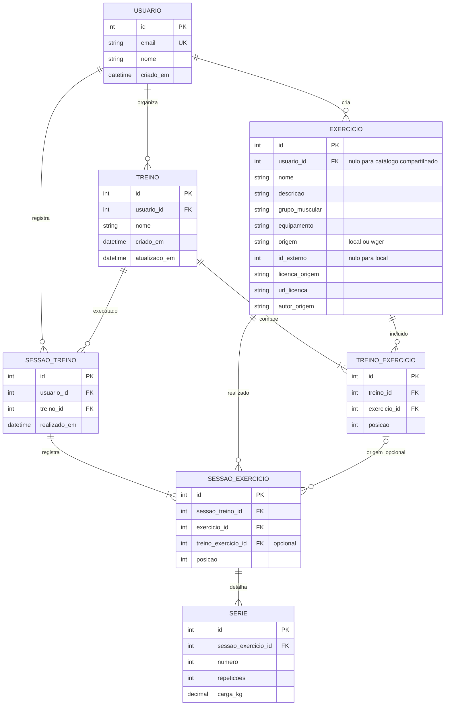

# Modelo de dados — Evolift

> Modelo lógico proposto para a Fase 1. Não cria nem configura um banco de dados. A tecnologia relacional e os tipos físicos serão definidos antes da implementação.

## Diagrama entidade-relacionamento

O arquivo editável é [`diagrama-er.mmd`](./diagrama-er.mmd); a versão PNG está em [`diagrama-er.png`](./diagrama-er.png).

## Entidades e atributos

| Entidade | Atributos principais | Chaves e observações |
|---|---|---|
| **Usuário** | `id`, `email`, `nome`, `criado_em` | `id` é PK; `email` é único. A senha não é um atributo exposto deste modelo: o Django deve armazenar apenas o hash gerido pelo seu sistema de autenticação. |
| **Exercício** | `id`, `usuario_id`, `nome`, `descricao`, `grupo_muscular`, `equipamento`, `origem`, `id_externo`, `licenca_origem`, `url_licenca`, `autor_origem` | `id` é PK; `usuario_id` é FK opcional para exercícios privados. `origem` diferencia exercício criado no Evolift e item do wger. O identificador externo é único em conjunto com a origem quando preenchido. Créditos e licença do item externo são preservados conforme os dados recebidos. |
| **Treino** | `id`, `usuario_id`, `nome`, `criado_em`, `atualizado_em` | `id` é PK; `usuario_id` é FK obrigatória para o proprietário. |
| **TreinoExercicio** | `id`, `treino_id`, `exercicio_id`, `posicao` | Associação entre treino e exercício; as duas FKs são obrigatórias. `posicao` permite manter a ordem, única dentro do treino. |
| **SessaoTreino** | `id`, `usuario_id`, `treino_id`, `realizado_em` | Registra a realização de um treino. `usuario_id` e `treino_id` são FKs obrigatórias; `realizado_em` alimenta o histórico. |
| **SessaoExercicio** | `id`, `sessao_treino_id`, `exercicio_id`, `treino_exercicio_id`, `posicao` | Registra o exercício efetivamente associado a uma sessão. A FK `treino_exercicio_id` pode ser nula para preservar a sessão mesmo se a composição do treino mudar; `exercicio_id` mantém a referência ao exercício. |
| **Serie** | `id`, `sessao_exercicio_id`, `numero`, `repeticoes`, `carga_kg` | Registra a série realizada. A combinação `sessao_exercicio_id` + `numero` é única. `repeticoes` deve ser inteiro positivo; `carga_kg` é decimal não negativo. |

Os nomes são lógicos; podem ser mapeados para nomes de tabelas/colunas compatíveis com as convenções do Django. `int`, `string`, `decimal` e `datetime` no desenho representam tipos conceituais, não uma escolha de dialeto.

## Relacionamentos e cardinalidades

- Um usuário pode ter zero ou vários exercícios privados, treinos e sessões; cada treino e sessão pertence a exatamente um usuário.
- Um treino contém zero ou vários exercícios por meio de `TreinoExercicio` (permitindo criar o treino antes de adicionar exercícios); um exercício pode aparecer em vários treinos.
- Um treino pode ser realizado em várias sessões; cada sessão referencia um treino e o usuário que a registrou.
- Uma sessão pode conter zero ou vários exercícios realizados por meio de `SessaoExercicio` enquanto o registro está sendo preenchido.
- Um exercício pode estar em várias composições de treino e em várias sessões.
- Cada exercício realizado em uma sessão pode ter zero ou várias séries enquanto o registro está sendo preenchido; cada série pertence a exatamente um exercício da sessão.
- Exercícios importados do catálogo externo não pertencem a um usuário específico (`usuario_id` nulo); exercícios privados pertencem ao usuário criador.

## Restrições de integridade

1. Email único; não armazenar nem retornar senha em claro.
2. Treino, sessão e exercício privado só podem ser lidos ou alterados pelo usuário proprietário.
3. Uma composição de treino não pode repetir a mesma posição; uma série não pode repetir o número dentro do mesmo exercício da sessão.
4. `numero` e `repeticoes` devem ser maiores que zero; `carga_kg` deve ser maior ou igual a zero.
5. `origem = local` exige proprietário e não usa `id_externo`; `origem = wger` exige identificador e metadados de proveniência. Aplicar unicidade para `(origem, id_externo)` nos registros externos.
6. Exclusões que apagariam registros de sessões ou séries devem ser impedidas; preservar o histórico tem prioridade sobre remoções em cascata.
7. Na associação opcional entre `SessaoExercicio` e `TreinoExercicio`, validar que ambas pertencem ao mesmo treino para não associar um exercício de outra rotina.

## Dados derivados

Histórico, evolução e relatório são consultas agregadas sobre `SessaoTreino`, `SessaoExercicio` e `Serie`; não exigem tabelas próprias nesta proposta. A evolução pode apresentar séries e cargas agrupadas por exercício e data, sem inferir prescrições ou diagnósticos.

## Observação sobre arquivos anteriores

Os arquivos `docs/modelagem/banco-de-dados/diagrama-er.pdf` e `docs/modelagem/banco-de-dados/modelo-logico.pdf` que já estavam no repositório representam **reservas de laboratórios** (usuários, laboratórios, reservas e equipamentos), não o Evolift. Foram preservados sem alteração por já existirem, mas não devem ser usados como modelo do projeto. Este documento e seu diagrama são a proposta correspondente ao escopo atual.
