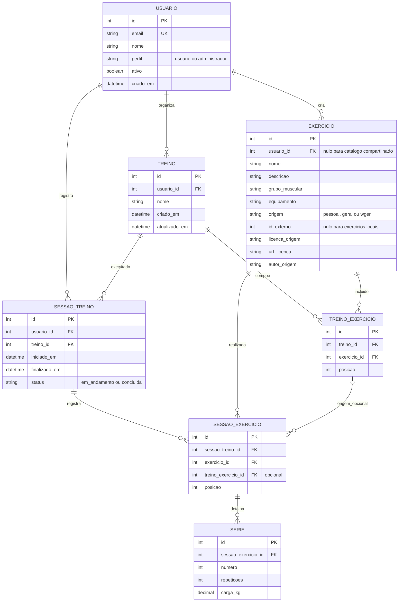

# Modelo de dados — Evolift

> Modelo lógico proposto para a Fase 1. Este documento descreve a estrutura planejada, sem criar ou configurar um banco de dados. O banco relacional e os tipos físicos serão definidos antes da implementação.

## Diagrama entidade-relacionamento

O arquivo editável do diagrama é [`diagrama-er.mmd`](./diagrama-er.mmd), e a versão para visualização está em [`diagrama-er.png`](./diagrama-er.png).

## Entidades e atributos

| Entidade | Atributos principais | Chaves e observações |
|---|---|---|
| **Usuário** | `id`, `email`, `nome`, `perfil`, `ativo`, `criado_em` | `id` é PK e `email` é único. `perfil` diferencia usuário comum e administrador; `ativo` indica se a conta pode acessar o sistema. As senhas ficarão sob responsabilidade da autenticação do Django, com armazenamento seguro de hash. |
| **Exercício** | `id`, `usuario_id`, `nome`, `descricao`, `grupo_muscular`, `equipamento`, `origem`, `id_externo`, `licenca_origem`, `url_licenca`, `autor_origem` | `id` é PK. `usuario_id` identifica o dono de um exercício pessoal, mas é opcional para itens do catálogo geral ou da wger. `origem` pode ser `pessoal`, `geral` ou `wger`. `id_externo` e os dados de licença/autoria se aplicam aos exercícios externos. |
| **Treino** | `id`, `usuario_id`, `nome`, `criado_em`, `atualizado_em` | `id` é PK; `usuario_id` é FK obrigatória para o proprietário do treino. |
| **TreinoExercicio** | `id`, `treino_id`, `exercicio_id`, `posicao` | Liga exercícios a treinos; ambas as FKs são obrigatórias. `posicao` define a ordem dos exercícios e não deve se repetir dentro do mesmo treino. |
| **SessaoTreino** | `id`, `usuario_id`, `treino_id`, `iniciado_em`, `finalizado_em`, `status` | `id` é PK. As FKs identificam o usuário e o treino. `iniciado_em` registra o começo; `finalizado_em` fica vazio enquanto a sessão está em andamento. `status` indica `em_andamento` ou `concluida`. |
| **SessaoExercicio** | `id`, `sessao_treino_id`, `exercicio_id`, `treino_exercicio_id`, `posicao` | Guarda os exercícios efetivamente registrados em uma sessão. `treino_exercicio_id` é opcional, para que o histórico continue consultável mesmo que o treino planejado seja alterado. |
| **Serie** | `id`, `sessao_exercicio_id`, `numero`, `repeticoes`, `carga_kg` | Registra as séries realizadas. A combinação de `sessao_exercicio_id` e `numero` deve ser única; `repeticoes` é um inteiro positivo e `carga_kg` não pode ser negativa. |

Os nomes e tipos acima são lógicos. No desenvolvimento, poderão ser adaptados às convenções do Django e ao banco relacional escolhido.

## Relacionamentos e cardinalidades

- Um usuário pode ter zero ou vários exercícios pessoais, treinos e sessões. Cada treino e sessão pertence a exatamente um usuário.
- Exercícios do catálogo geral ou provenientes da wger não possuem proprietário pessoal (`usuario_id` nulo); exercícios particulares pertencem ao usuário que os cadastrou.
- Um treino pode ser criado sem exercícios e receber vários exercícios posteriormente, por meio de `TreinoExercicio`. Um mesmo exercício pode integrar diversos treinos.
- Um treino pode originar várias sessões de execução. Cada sessão referencia um treino e o usuário que a realizou.
- Uma sessão pode não ter exercícios registrados logo após ser iniciada. Os registros são adicionados por meio de `SessaoExercicio`.
- Um exercício pode aparecer em várias sessões. Cada exercício de uma sessão pode receber zero ou várias séries enquanto o usuário preenche os resultados.
- A referência `treino_exercicio_id` é opcional, pois a composição do treino pode mudar depois de uma sessão registrada.

## Restrições de integridade

1. O e-mail de cada conta deve ser único. Senhas não devem ser armazenadas nem retornadas em texto puro.
2. O campo `perfil` distingue `usuario` e `administrador`, e `ativo` controla se a conta está habilitada. Apenas administradores podem gerenciar contas e o catálogo geral.
3. Usuários comuns só podem consultar e modificar seus próprios treinos, exercícios particulares e registros. O perfil de administrador não permite acesso automático a históricos pessoais.
4. Um exercício com `origem = pessoal` exige `usuario_id` válido. Exercícios com `origem = geral` ou `origem = wger` não têm proprietário pessoal. O catálogo geral é mantido pelo administrador.
5. Exercícios da wger exigem `id_externo` e os metadados de origem/licença aplicáveis. A combinação `(origem, id_externo)` deve ser única quando houver identificador externo. Os créditos devem ser preservados conforme as condições de uso de cada item.
6. A posição de um exercício não pode se repetir dentro do mesmo treino. Da mesma forma, o número da série não pode se repetir dentro de um mesmo exercício de sessão.
7. `numero` e `repeticoes` devem ser maiores que zero, enquanto `carga_kg` deve ser maior ou igual a zero.
8. Uma sessão com `status = em_andamento` possui `iniciado_em` e ainda não possui `finalizado_em`. Ao concluir, deve registrar `finalizado_em`, que não pode ser anterior ao início.
9. A conclusão da sessão inclui a geração do resumo (UC07 e UC08). Se houver falha nessa etapa, os registros já salvos devem ser preservados e a conclusão não deve ser confirmada indevidamente.
10. Exclusões ou edições de treinos e exercícios não devem apagar sessões e séries históricas. Quando necessário, o item pode deixar de aparecer em novas seleções sem eliminar referências existentes.
11. Se `SessaoExercicio` apontar para `TreinoExercicio`, as referências devem ser compatíveis com o treino e o exercício da sessão, evitando associações incorretas.

## Dados derivados

O **histórico de treinos** é obtido a partir das sessões concluídas e seus registros. A data de início, a data de término e o status ajudam a ordenar e identificar cada sessão.

O **resumo da sessão** é gerado automaticamente ao finalizar um treino, com a duração calculada a partir de `iniciado_em` e `finalizado_em`, além dos exercícios, séries, repetições e cargas registrados.

A **evolução** e os **relatórios de desempenho** são calculados com base em `SessaoTreino`, `SessaoExercicio` e `Serie`. Nesta proposta, não é necessário criar tabelas específicas para essas consultas: os indicadores podem ser obtidos dos registros existentes.

Essas informações pertencem ao Evolift e não dependem da disponibilidade da API externa wger.

## Observação sobre arquivos anteriores

Os PDFs `docs/modelagem/banco-de-dados/diagrama-er.pdf` e `docs/modelagem/banco-de-dados/modelo-logico.pdf` herdados do template original apresentam um sistema de **reservas de laboratórios**, e não o Evolift. Eles não devem ser utilizados na entrega como representação do modelo atual. O documento e o diagrama desta pasta descrevem a proposta do Evolift para a Fase 1.
